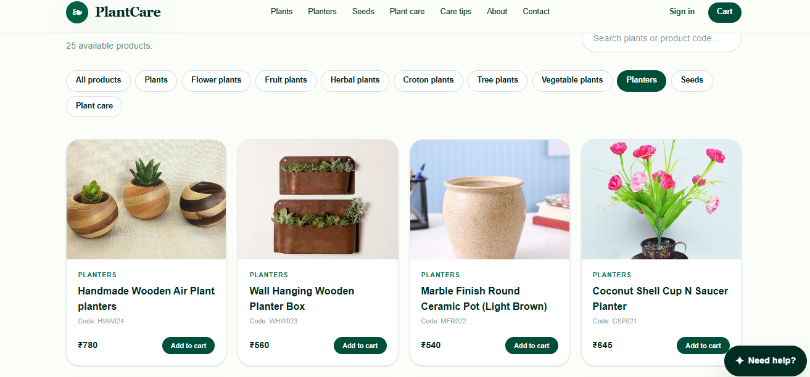
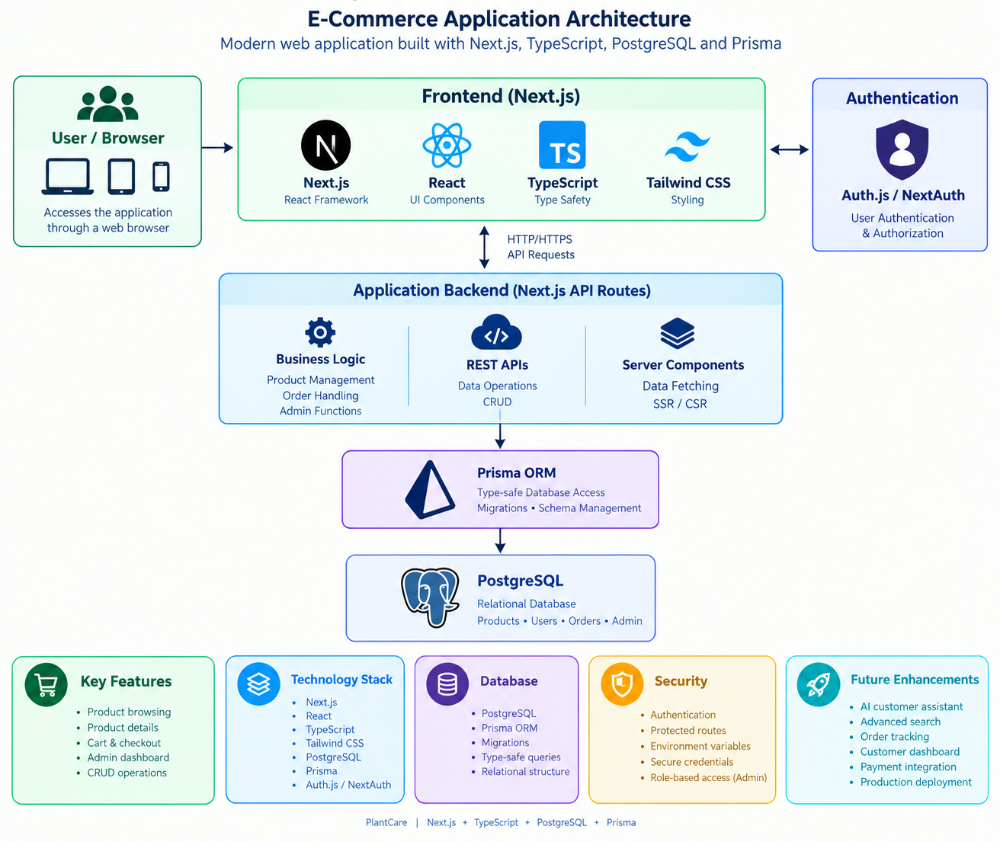

# PlantCare – Next.js + PostgreSQL

A full-stack plant e-commerce web application modernized from a legacy PHP/MySQL project to a modern Next.js and PostgreSQL stack.

## Overview

PlantCare is an e-commerce application for browsing and managing plant products.

The project demonstrates full-stack development using Next.js, TypeScript, PostgreSQL, Prisma, authentication, and responsive UI development.

## Screenshots

### Home Page


### Products




### Product Details


### Admin Dashboard


## Application Architecture

The application follows a modern full-stack architecture using Next.js, TypeScript, PostgreSQL, Prisma ORM, and Auth.js.



## Key Features

- Plant product listing
- Product details
- Product image management
- PostgreSQL database
- Prisma ORM
- Authentication
- Admin functionality
- Product CRUD operations
- Responsive web interface
- Structured application architecture

## Technology Stack

### Frontend

- Next.js
- React
- TypeScript
- Tailwind CSS

### Backend

- Next.js
- Server-side application logic
- REST/API-based operations

### Database

- PostgreSQL
- Prisma ORM

### Authentication

- Auth.js / NextAuth

### Development Tools

- VS Code
- Git
- GitHub
- ESLint

## Project Structure

```text
plantcare-postgres/
├── app/
├── components/
├── lib/
├── prisma/
├── public/
├── types/
├── auth.ts
├── package.json
├── next.config.ts
├── tsconfig.json
└── README.md
```
## Customer Support Chatbot

PlantCare includes a rule-based customer support chatbot integrated with the application backend.

The chatbot can:

* Track the signed-in customer's latest order
* Retrieve order status from PostgreSQL
* Provide order information and item details
* Recommend products from the catalogue
* Answer common delivery and shipping questions
* Provide return and refund guidance
* Answer basic payment questions
* Provide basic plant-care guidance
* Direct customers to the contact/support page

The chatbot uses Next.js API routes, Prisma, PostgreSQL, and Auth.js to securely access customer-specific order information.

### Planned Enhancement

An AI/LLM-powered conversational assistant can be added as a future enhancement to provide more flexible natural-language responses and contextual customer support.
