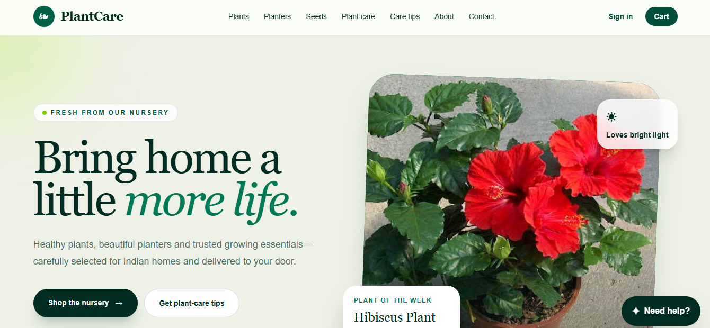
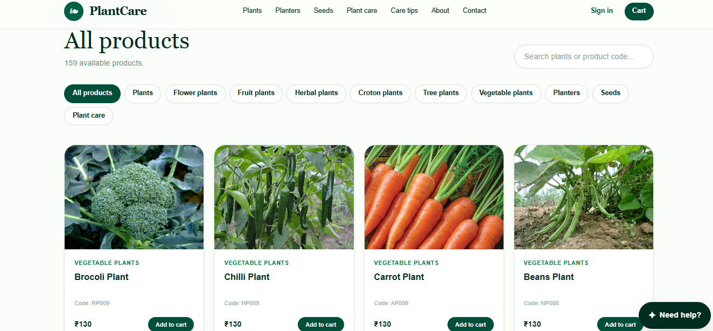
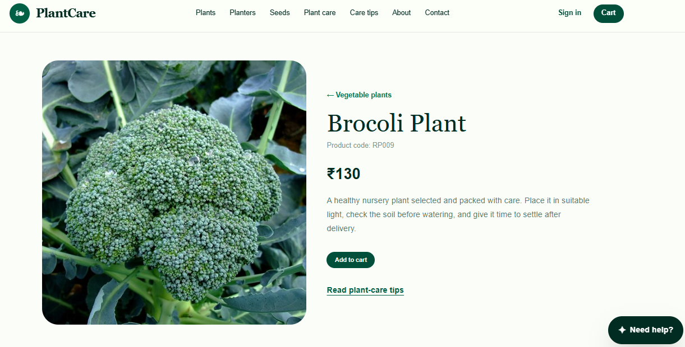
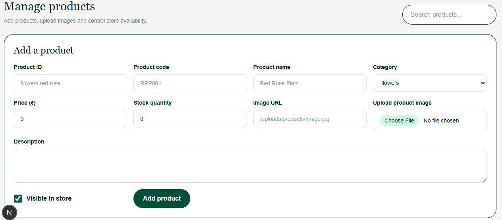

# PlantCare – Next.js + PostgreSQL

A full-stack plant e-commerce web application modernized from a legacy PHP/MySQL project to a modern Next.js and PostgreSQL stack.

## Overview

PlantCare is an e-commerce application for browsing and managing plant products.

The project demonstrates full-stack development using Next.js, TypeScript, PostgreSQL, Prisma, authentication, and responsive UI development.

## Screenshots

### Home Page



### Products



### Product Details



### Admin Dashboard



## Key Features

- Plant product listing
- Product details
- Product image management
- PostgreSQL database
- Prisma ORM
- Authentication
- Admin functionality
- Product CRUD operations
- Responsive web interface
- Structured application architecture

## Technology Stack

### Frontend

- Next.js
- React
- TypeScript
- Tailwind CSS

### Backend

- Next.js
- Server-side application logic
- REST/API-based operations

### Database

- PostgreSQL
- Prisma ORM

### Authentication

- Auth.js / NextAuth

### Development Tools

- VS Code
- Git
- GitHub
- ESLint

## Project Structure

```text
plantcare-postgres/
├── app/
├── components/
├── lib/
├── prisma/
├── public/
├── types/
├── auth.ts
├── package.json
├── next.config.ts
├── tsconfig.json
└── README.md
